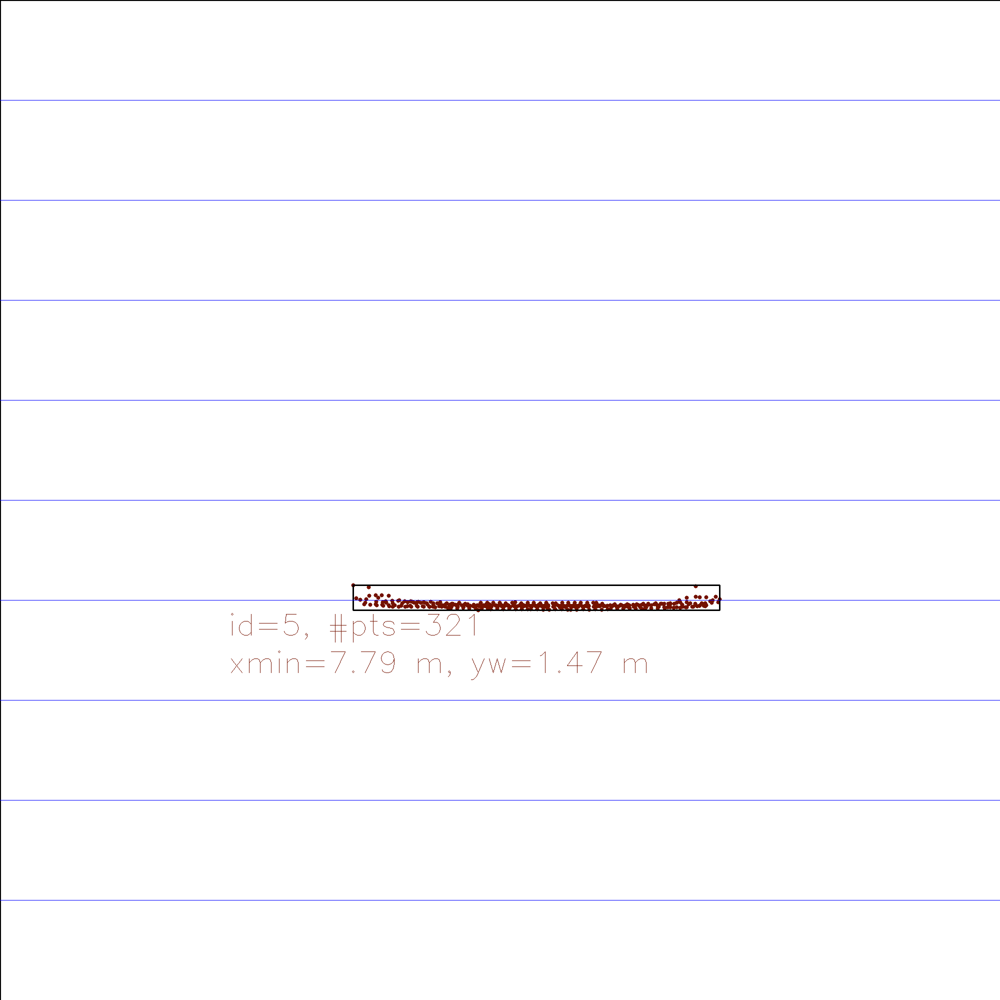
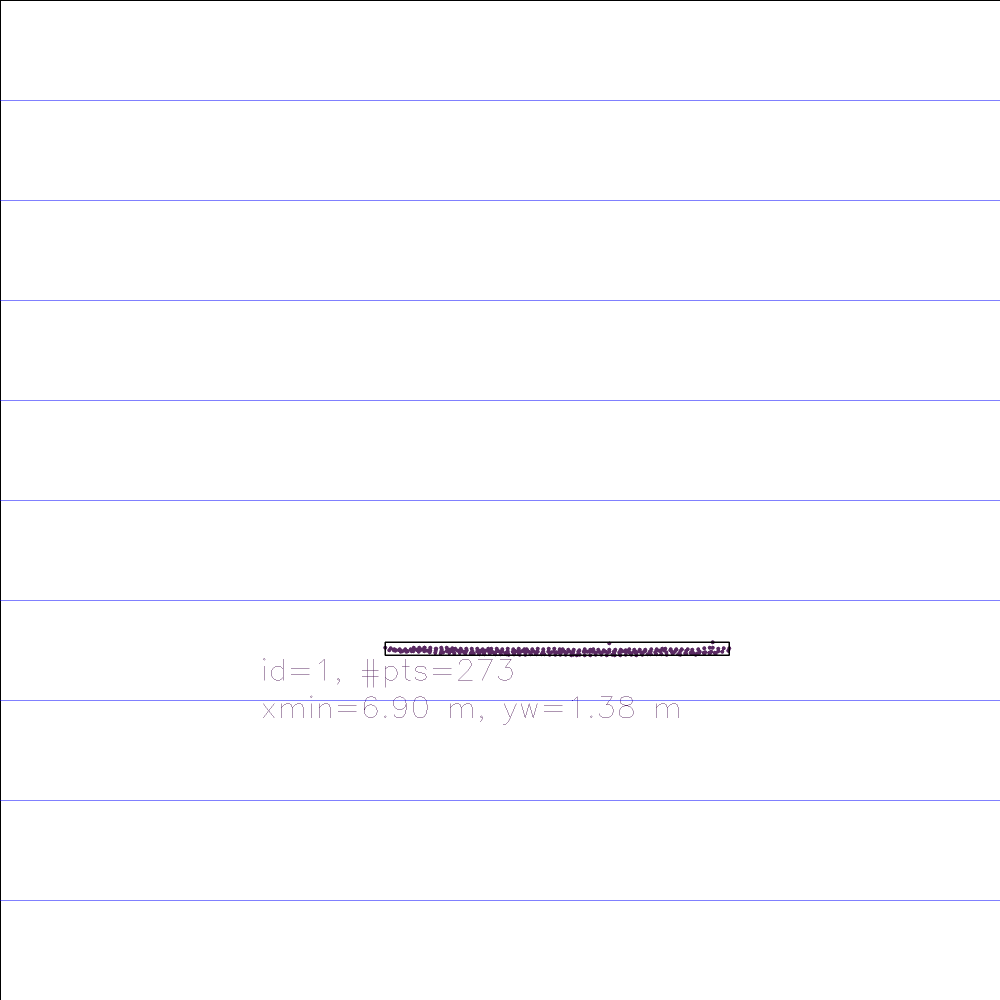
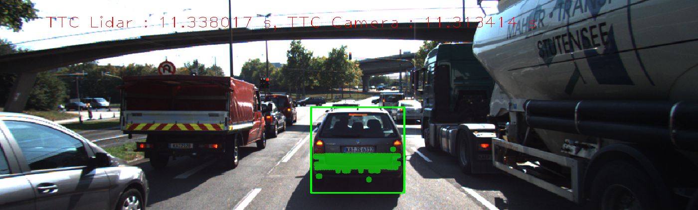

# Report

## Overview
In this project, we implemented the basic time-to-collision (TTC) computation based on Lidar and camera data, and basic comparison among different feature detectors and descriptors will be made.

## Running and Result
You can try diff combinations of detectors and descriptors invoking the program with params, e.g., `3D_object_tracking SHITOMASI BRIEF` where the first param is the detector type and the second is the descriptor. If not inputting in this format, the default SHITOMASI and BRISK pair will be used. After all processing is done, the program will also print out the recorded TTC values.

## Implementation FP 1: Bounding box matching
The essence of this part is to iterate through all provided matches, and then retain those falling into the ROI specified in each frame. At this point, we know which bounding box contains that match, hence mapping the box ID in the previous frame to the current one. The final step would then be finding out the pair with the most matches.

## Implementation FP 2: TTC Lidar
The key idea is to follow the logic from the lecture: for 2 consecutive frames, find those lidar points within the road ego lane, and among those filtered, get the ones closest to the primary vehicle (us, the vehicle with the Lidar equipment). Find the values for 2 consecutive frames and compute the distance travelled and then the time to collision can be calculated. However, note that this method could be outlier-prone, meaning if a certain point is too close to the vehicle, e.g., due to reflection or similar cases, the laser beam reflected back immediately without actually hitting the preceeding vehicle, then this "closest distance" will lead to inaccurate measurement. Therefore, in my implementation, I'm not using the closest distance, but rather going with the average distances. Additionally, I'm not using all of them to compute the average, but get the middle 80% from the collection after sorting, which should be able to yield a distance much less error-prone.

## Implementation FP 3: Cluster key points
Ideally this section could be simple, where we just check if the current key point falls into the current bounding box. However, as noted in the project description, once again sometimes we have outliers in the supplied matches, so we'll do another savity check and not use everything in the collection. My method is to iterate through the distances between matched points, and if this distance is beyond an acceptable value, we'll disgard it. The recommended scheme is to just use the mean, but that may be too "extreme" in a way that we remove almost half of the points immediately, in my opinion could lead to insufficient data entries for subsequent steps, therefore I enlarged this threshold a bit, by using the average of the larger half of the collection.

## Implementation FP 4: TTC Camera
This part is primarily reusing the logic from the lecture, where we'll be computing the distance ratios between key points (plus using the median value to get rid of outliers), and then see how fast that ratio is changing, hence compute the speed and time to collision.

## Evaluation FP 5: TTC Lidar
The detailed record of TTC Lidar can be found in the following table.

| Frame01 | Frame02 | Frame03 | Frame04 | Frame05 | Frame06 | Frame07 | Frame08 | Frame09 | Frame10 | Frame11 | Frame12 | Frame13 | Frame14 | Frame15 | Frame16 | Frame17 | Frame18 |
|:-------:|:-------:|:-------:|:-------:|:-------:|:-------:|:-------:|:-------:|:-------:|:-------:|:-------:|:-------:|:-------:|:-------:|:-------:|:-------:|:-------:|:-------:|
| 12.5882 | 12.9442 | 16.8044 | 15.0972 | 13.0216 | 13.6472 | 12.6392 | 12.9987 | 12.6527 | 12.1577 | 11.9342 | 10.1686 | 9.26743 | 9.40004 | 8.33918 | 9.04292 | 11.338  | 8.17805 |

The task is to check the "outlier" result, where the Lidar TTC is way off. But as seen in the above table, there's no obvious "extreme outliers" in my collection, probably due to all the robustness sanity check and the removal of input outliers. But, if we must say the strange thing about the result, then it happened for the cases:
* __Transition from Frame 2 to Frame 3 and 4__: clearly there's this sudden jump in value, and;
* __Transition from Frame 16 to Frame 17__: another jump.

So taking a look at the generated keypoints and TTC output, and try to compare it against those seemingly more accurate ones: 

Transition into Frame 3 and 4:

A more accurate one, where TTC camera and TTC Lidar give almost the same result:

We see that clearly when we transition into frame 3 and 4, there's an increase in the number of points __not centered around the vehicle__, and some of the points are sparsely distributed and almost located to the edge of the bounding box. This aligns with our initial assumption: if for any reason the points overlap with outlier objects, the estimate would drift. In this case, it's clear that those points are the road points instead of vehicles, hence yielding a larger x distance, and consequently a sudden jump in TTC.

## Evaluation FP 6: TTC Camera for all detector/descriptor pairs
Below is a sample output generated by the default SHITOMASI/BRISK pair:

The detailed record of TTC Camera for each frame + each detector and descriptor can be found in the following table. 

|Detector,Descriptor/Frame| Frame01 | Frame02 | Frame03 | Frame04 | Frame05 | Frame06 | Frame07 | Frame08 | Frame09 | Frame10 | Frame11 | Frame12 | Frame13 | Frame14 | Frame15 | Frame16 | Frame17 | Frame18 |
|:----------------------: |:-------:|:-------:|:-------:|:-------:|:-------:|:-------:|:-------:|:-------:|:-------:|:-------:|:-------:|:-------:|:-------:|:-------:|:-------:|:-------:|:-------:|:-------:|
|    SHITOMASI/BRISK      | 12.8228 | 12.6968 | 14.4793 | 12.7779 | 12.5109 | 14.0207 | 12.7924 | 14.2932 | 12.5494 | 13.3275 | 12.0367 | 12.9124 | 13.0323 | 12.6532 | 11.8987 | 10.6857 | 11.3134 | 11.4955 |
|     SHITOMASI/BRIEF     | 14.2952 | 12.9876 | 10.1673 | 11.5009 | 13.2483 | 13.7648 | 13.4924 | 12.5881 | 12.2953 | 13.4042 | 11.4293 | 12.1312 | 12.9306 | 13.4865 | 11.9757 | 12.1502 | 13.1184 | 8.38114 |
|      SHITOMASI/ORB      | 14.5798 | 12.3815 | 11.8924 | 12.5963 | 13.0276 | 13.4761 | 12.5645 | 14.2388 | 10.6746 | 13.3212 | 11.4293 | 12.1102 |  12.611 | 11.545  | 9.06495 | 11.7852 | 12.2595 | 11.3382 |
|      SHITOMASI/FREAK    | 13.0861 |  12.391 | 13.4354 | 11.6234 | 12.5462 | 13.4761 | 12.5185 | 10.8914 | 11.9559 |  12.902 | 11.1899 | 15.2554 | 12.5287 | 11.9191 | 11.1548 | 8.38985 | 11.8304 | 10.7105 |
|      SHITOMASI/SIFT     | 14.0746 | 14.6618 | 14.3827 | 13.0192 | 13.3479 | 14.1323 | 13.935  | 14.5085 | 12.2319 | 13.3599 | 12.3562 | 11.6524 | 12.8498 | 12.7102 | 12.3541 | 13.1068 | 13.1247 | 12.0881 |
|       HARRIS/BRISK      | 10.9082 | 10.586 | nan | 10.9782 | -inf | nan | 12.2792 | -inf | nan | -inf | -inf | 12.245 | 13.456 | nan | -inf | 6.33866 | nan | -inf |
|       HARRIS/BRIEF      | 10.9082 | nan | nan | 10.9782 | 35.3833 | 13.5907 | 12.2792 | 17.6204 | 3.30058 | -inf | 11.8135 | nan | -inf | 5.6061 | -inf | 8.86241 | 12.5848 | -inf |
|        HARRIS/ORB       | 10.9082 | 10.586 | -inf | 10.9782 | 35.3833 | nan | 13.6036 | -inf | nan | nan | 11.2142 | 11.9536 | 13.4327 | nan | -inf | 6.60338 | nan | -inf |
|HARRIS/FREAK(core dumped)|   nan   | nan | nan | nan | nan | nan | nan | nan | nan | nan | nan | nan | nan | nan | nan | nan | nan | nan |
|        HARRIS/SIFT      | 10.9082 | 11.0081 | -11.4731 | 10.9782 | 35.3833 | 15.2483 | 13.1905 | 17.6204 | nan | 10.2931 | 11.7414 | 12.245 | 568.322 | 5.6061 | -13.6263 | 7.03775 | 12.5848 | -inf |
|        FAST/BRISK       | 12.1352 | 12.3453 | 15.2747 | 12.8853 | 99.5628 | 13.5604 | 12.1368 | 11.5105 | 12.0205 | 13.6097 | 12.3427 | 12.2816 | 12.7784 | 12.0961 | 13.0655 | 13.9142 | 10.5959 | 12.3793 |
|        FAST/BRIEF       | 11.5908 | 13.0256 | 12.9553 | 13.2215 | 24.8751 | 13.2534 | 11.6839 | 11.0579 | 11.8969 | 13.3448 | 13.3932 | 10.8622 | 12.8743 | 12.5199 | 12.1879 | 11.9434 | 7.77786 | 11.6071 |
|         FAST/ORB        | 10.5719 | 12.6506 | 14.8664 | 13.6805 | 17.6913 | 12.6793 | 11.4488 | 11.9236 | 11.7236 | 13.8064 | 13.2738 | 13.3932 | 12.4567 | 11.5952 | 12.4947 | 12.2753 | 10.8571 | 11.3337 |
|         FAST/FREAK      | 8.44411 | 12.7571 | 11.0632 | 12.9486 | 13.0459 | 11.9483 | 11.8818 | 11.7849 | 12.0205 | 13.8308 | 12.5561 | 12.3725 | 12.5127 | 11.8881 | 10.1798 | 11.9692 | 11.8476 | 12.6702 |
|         FAST/SIFT       | 12.3317 | 12.8526 | 20.0483 | 15.4897 |   -inf  | 13.9137 | 12.2781 | 12.5624 | 13.3673 | 14.0112 | 15.8801 | 12.7731 | 12.9215 |  12.879 | 12.6071 | 12.9069 | 10.5264 | 12.6506 |
|       BRISK/BRISK       | 14.1477 | 24.5712 | 18.8166 | 17.2082 | 26.3805 | 14.6337 | 15.5437 | 22.9223 | 21.0653 | 14.3012 | 11.9485 | 15.0426 | 14.9882 | 14.1159 | 16.7513 | 11.0861 | 12.0011 | 15.9376 |
|       BRISK/BRIEF       | 13.8976 | 13.0946 | 13.6711 | 15.6261 | 13.5831 | 18.1473 | 13.4611 | 16.8297 | 15.2453 | 13.0925 | 12.2422 |  12.957 |  13.148 | 10.6682 | 11.8821 | 12.1509 | 9.04962 | 10.7774 |
|        BRISK/ORB        | 14.1922 | 20.4706 | 14.7169 | 15.5328 | 20.9575 |  28.651 | 15.6848 | 13.7829 | 14.3993 | 12.0746 | 12.015  | 15.3717 |  11.18  | 11.1358 | 12.0532 | 12.1448 | 8.66377 | 11.455  |
|        BRISK/FREAK      | 19.0684 | 21.7152 | 14.9992 | 16.1849 | 31.8945 | 14.8626 | 17.2715 | 16.2216 | 17.3305 | 12.2923 | 13.0359 |  12.402 | 11.8439 | 11.2707 | 14.6161 | 9.89414 |  11.129 | 10.2741 |
|        BRISK/SIFT       | 13.1378 | 16.2077 | 17.3541 | 13.5364 | 32.3682 | 16.0962 | 13.7289 | 16.4396 | 17.7328 | 15.2853 | 13.4007 |  11.346 | 14.0086 | 10.9752 | 14.1552 | 10.7937 | 10.5311 | 12.0657 |
|         ORB/BRISK       | 18.773 | 16.318 | 15.0463 | 32.9777 | 94.009 | 19.9415 | 12.9706 | 10.911 | -inf | -inf | 7.29473 | -inf | 22.4629 | 35.3185 | 13.594 | 26.3083 | 22.0602 | 28.0396 |
|         ORB/BRIEF       | 13.0822 | -inf | 48.7666 | 46.9127 | 19.7893 | 11.5198 | -inf | -inf | -inf | 37.8466 | 24.9891 | 16.9677 | -inf | -inf | 164.864 | 13.0005 | 16.8713 | 25.8155 |
|         ORB/ORB         | 19.4124 | 11.3699 | 22.95 | 197.151 | 28.7796 | -inf | 19.9077 | -inf | -inf | -inf | 9.74456 | -inf | -inf | 38.7938 | 30.6161 | 26.3083 | 8.84033 | 82.4247 |
|         ORB/FREAK       | 14.4733 | 38.7882 | 10.6861 | 11.325 | -inf | 12.8725 | -inf | 8.95665 | 30.2417 | -inf | 8.76336 | 9.5384 | 7.03048 | 38.4661 | -inf | 7.76548 | 9.93894 | 7.62862 |
|         ORB/SIFT        | 16.7473 | 13.8583 | 15.4791 | -inf | 502.13 | 17.9796 | 127.591 | 10.7453 | 21.2278 | 25.1619 | 8.32267 | -inf | 9.47706 | 13.7643 | 33.3507 | 9.80584 | 18.702 | 14.2111 |
|       AKAZE/AKAZE       | 13.9526 | 19.1145 | 14.6763 | 14.0162 | 15.1593 | 17.9757 | 15.1771 | 14.1023 | 13.7975 | 15.6412 | 12.2031 | 11.4888 | 10.837 | 13.8534 | 12.7913 | 12.162 | 10.5705 | 9.00451 |
|        SIFT/BRISK       | 11.7937 | 13.696 | 19.3196 | 28.5109 | 19.8395 | 10.7762 | 20.4197 | 16.1715 | 13.647 | 16.7555 | 12.9654 | 10.3343 | 12.4611 | 9.15168 | 9.88476 | 10.5549 | 11.2425 | 9.36821 |
|        SIFT/BRIEF       | 12.0019 | 14.6348 | 15.3619 | 21.9072 | 15.0725 | 15.511 | 14.9089 | 15.8058 | 12.1096 | 11.2531 | 11.9296 | 11.433 | 9.27531 | 13.111 | 9.28974 | 9.47477 | 10.5519 | 12.861 |
| SIFT/ORB(out of memory) |   nan   | nan | nan | nan | nan | nan | nan | nan | nan | nan | nan | nan | nan | nan | nan | nan | nan | nan |
|        SIFT/FREAK       | 16.7892 | 12.9029 | 14.2109 | 18.4778 | 15.734 | 16.3638 | 15.4365 | 15.5756 | 14.6324 | 11.3657 | 15.1268 | 14.1411 | 11.8674 | 14.4245 | 9.43476 | 9.70694 | 9.36457 | 9.54427 |
|        SIFT/SIFT        | 11.3857 | 12.5728 | 12.942 | 18.8185 | 12.4788 | 11.0585 | 13.5735 | 14.6941 | 13.3986 | 12 | 11.2887 | 11.0196 | 11.9454 | 10.5761 | 9.77498 | 9.05262 | 8.69158 | 9.23255 |

This time, unlike the previous project, a lot of exceptions are generated, so the question of "which pair performs the best" now also includes the consideration of __stability__. And clearly these candidates are having trouble with that: HARRIS, ORB, SIFT, where lots if `nan` and `-inf` are seen. The best one from last project, FAST based detectors and descriptors, now seem to work, however, note that for outlier transitions into Frame 3 and 4 in the previous section, FAST is now performing worse: almost every one is seeing a jump from a common 12-13 seconds to 17, 24, or even 99 seconds. Therefore, based on these findings, I'll recommend these candidates:
* FAST/FREAK;
* SHITOMASI/FREAK;
* SHITOMASI/ORB

Since they produce more consistent outputs.Looking back to our report in project 2, this could potentially be due to the fact that SHITOMASI, FAST, HARRIS are all detectors producing key points with consistent sizes, which leads to more consistent computation. However, rememeber we mentioned in the report, that HARRIS has this problem of detecting way fewer points as compared to others, so it's possible that the lack of useful points by HARRIS caused its performance drop here, probably the worst among all candidates.